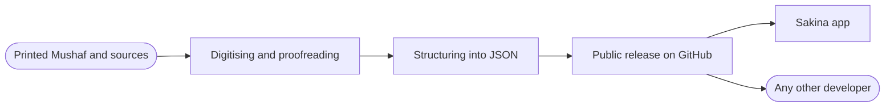

 

 

---

## Who we are

We build **Islamic applications for Tajik speakers** and publish the data
behind them as **open datasets** — translations, word-by-word analysis,
tafsir and Mushaf rendering packages.

Most Qur'an data on the internet exists in Arabic, English or Turkish.
For **Tajik** there was almost nothing machine-readable. We are fixing that:
every dataset we prepare for our own app is released publicly, in clean JSON,
so any developer can build on it.

| | |
|---|---|
| **Focus** | Qur'an, hadith, athkar, prayer times |
| **Languages** | Tajik · Persian · Russian · Arabic |
| **Platform** | Flutter — Android and iOS |
| **Data** | Public releases, free to use |

---

## Our application

### Sakina: Зикр, Ҳаҷ, Дуо, Тасбеҳ

Full Qur'an with audio and tajweed, athkar from *Hisn al-Muslim*,
99 names of Allah, prayer times by geolocation, tasbih counter
and a step-by-step Hajj and Umrah guide — in Tajik.

| | | | |
|:---:|:---:|:---:|:---:|
| **604** | **114** | **9** | **99** |
| Mushaf pages | surahs | reciters | names of Allah |

---

## Open datasets

Everything below is **free to download and use**. Large files are published
as **release assets**, so cloning stays fast.

### Qur'an text and translations

| Repository | Contents | Size |
|---|---|:---:|
| **[quran-data](https://github.com/SakinaDevGroup/quran-data)** | Bundle of 10 datasets: QPC v4, tajweed pages, metadata, transliteration, tafsir *Osonbayon*, Tajik translations (Ayati, Alomuddin, Pioneers), Russian (Kuliev), Persian | 5.3 MB |
| **[quran-tajik-translate-json](https://github.com/SakinaDevGroup/quran-tajik-translate-json)** | Tajik translation of the Qur'an, JSON | 3.8 MB |
| **[quran-word-by-word-russian](https://github.com/SakinaDevGroup/quran-word-by-word-russian)** | Word-by-word Russian analysis of every ayah | 5.2 MB |
| **[quran-word-by-word-farsi](https://github.com/SakinaDevGroup/quran-word-by-word-farsi)** | Word-by-word Persian analysis of every ayah | 4.9 MB |

### Mushaf rendering

| Repository | Contents | Size |
|---|---|:---:|
| **[al_quran_madani](https://github.com/SakinaDevGroup/al_quran_madani)** | Madani 1405 Mushaf render package (QCF) | 46 MB |
| **[KFGQPC_V4_tajweed](https://github.com/SakinaDevGroup/KFGQPC_V4_tajweed)** | KFGQPC V4 layout: 604 page fonts (WOFF2) with tajweed colouring + page data JSON | 49 MB |

### Hadith

| Repository | Contents | Size |
|---|---|:---:|
| **[sahih-al-bukhari-tajik-json](https://github.com/SakinaDevGroup/sahih-al-bukhari-tajik-json)** | Sahih al-Bukhari in Tajik, structured JSON | 1.4 MB |

> **How to download:** open a repository → **Releases** → grab the archive.
> No account, no registration, no limits.

---

## How the data reaches the reader

We do not keep the pipeline private. The same files that ship inside
Sakina are the ones published in the releases.

---

## Tech stack

**Application**

**Data and tooling**

**Formats**

---

## Using our data?

You are welcome to. A few requests:

- **Credit the source** — link back to the repository you used
- **Respect upstream rights** — Mushaf layouts and fonts belong to the
  **King Fahd Glorious Qur'an Printing Complex (KFGQPC)**; check their terms
  before shipping commercially
- **Report mistakes** — open an issue if you spot an error in a translation
  or in the data. Accuracy in religious texts matters more than speed.

---

## Order a project

We also build applications to order — Islamic, educational or reference.
Flutter for Android and iOS, including full publication to Google Play
and the App Store.

 

