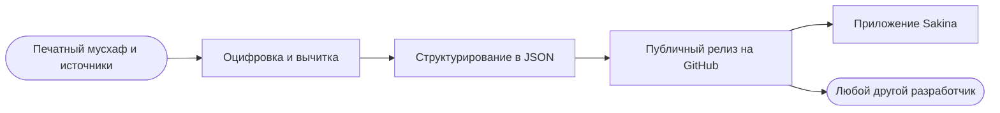

 

---

## Кто мы

Разрабатываем **исламские приложения для таджикоязычных пользователей**
и публикуем данные, на которых они работают, как **открытые наборы** —
переводы, пословный разбор, тафсир и пакеты отрисовки мусхафа.

Данные по Корану в интернете есть на арабском, английском, турецком.
Для **таджикского** машиночитаемых данных почти не было. Мы это исправляем:
каждый набор, подготовленный для собственного приложения, выкладываем
публично в чистом JSON — чтобы любой разработчик мог им воспользоваться.

| | |
|---|---|
| **Направление** | Коран, хадисы, азкары, время намаза |
| **Языки** | таджикский · персидский · русский · арабский |
| **Платформа** | Flutter — Android и iOS |
| **Данные** | Публичные релизы, свободное использование |

---

## Наше приложение

### Sakina: Зикр, Ҳаҷ, Дуо, Тасбеҳ

Полный Коран с аудио и таджвидом, азкары из «Ҳисн-ул-муслим»,
99 имён Аллаха, время намаза по геолокации, тасбех
и пошаговый путеводитель по Хаджу и Умре — на таджикском языке.

| | | | |
|:---:|:---:|:---:|:---:|
| **604** | **114** | **9** | **99** |
| страницы мусхафа | суры | чтецов | имён Аллаха |

---

## Открытые наборы данных

Всё перечисленное **можно свободно скачать и использовать**. Крупные файлы
выложены в **релизах**, поэтому клонирование остаётся быстрым.

### Текст Корана и переводы

| Репозиторий | Содержимое | Размер |
|---|---|:---:|
| **[quran-data](https://github.com/SakinaDevGroup/quran-data)** | Сборник из 10 наборов: QPC v4, страницы с таджвидом, метаданные, транслитерация, тафсир «Осонбаён», таджикские переводы (Аяти, Аломуддин, Pioneers), русский (Кулиев), персидский | 5,3 МБ |
| **[quran-tajik-translate-json](https://github.com/SakinaDevGroup/quran-tajik-translate-json)** | Таджикский перевод Корана в JSON | 3,8 МБ |
| **[quran-word-by-word-russian](https://github.com/SakinaDevGroup/quran-word-by-word-russian)** | Пословный русский разбор каждого аята | 5,2 МБ |
| **[quran-word-by-word-farsi](https://github.com/SakinaDevGroup/quran-word-by-word-farsi)** | Пословный персидский разбор каждого аята | 4,9 МБ |

### Отрисовка мусхафа

| Репозиторий | Содержимое | Размер |
|---|---|:---:|
| **[al_quran_madani](https://github.com/SakinaDevGroup/al_quran_madani)** | Пакет отрисовки мединского мусхафа 1405 (QCF) | 46 МБ |
| **[KFGQPC_V4_tajweed](https://github.com/SakinaDevGroup/KFGQPC_V4_tajweed)** | Вёрстка KFGQPC V4: 604 постраничных шрифта WOFF2 с раскраской таджвида + JSON вёрстки страниц | 49 МБ |

### Хадисы

| Репозиторий | Содержимое | Размер |
|---|---|:---:|
| **[sahih-al-bukhari-tajik-json](https://github.com/SakinaDevGroup/sahih-al-bukhari-tajik-json)** | Сахих аль-Бухари на таджикском, структурированный JSON | 1,4 МБ |

> **Как скачать:** откройте репозиторий → раздел **Releases** → возьмите архив.
> Без аккаунта, без регистрации, без ограничений.

---

## Как данные попадают к читателю

Мы не держим этот процесс в тайне. Те же файлы, что лежат внутри Sakina,
опубликованы в релизах.

---

## Технологии

**Приложение**

**Данные и инструменты**

**Форматы**

---

## Используете наши данные?

Пожалуйста. Три просьбы:

- **Укажите источник** — поставьте ссылку на репозиторий, который взяли
- **Соблюдайте права первоисточника** — вёрстка мусхафа и шрифты принадлежат
  **Комплексу имени короля Фахда (KFGQPC)**; перед коммерческим использованием
  сверьтесь с их условиями
- **Сообщайте об ошибках** — откройте issue, если заметили неточность
  в переводе или в данных. В религиозных текстах точность важнее скорости.

---

## Заказать проект

Мы также разрабатываем приложения на заказ — исламские, образовательные
или справочные. Flutter для Android и iOS, включая полную публикацию
в Google Play и App Store.

 

