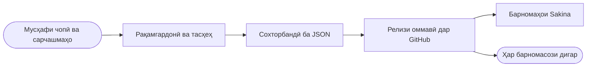

 

---

## Мо кистем

Мо **барномаҳои исломӣ барои тоҷикзабонон** месозем ва маълумотеро,
ки онҳо бо он кор мекунанд, ҳамчун **маҷмӯаҳои кушода** нашр мекунем —
тарҷумаҳо, таҳлили калима ба калима, тафсир ва бастаҳои тарҳи мусҳаф.

Маълумот дар бораи Қуръон дар интернет ба забонҳои арабӣ, англисӣ ва туркӣ
мавҷуд аст. Барои **тоҷикӣ** маълумоти мошинхон қариб набуд. Мо инро ислоҳ
мекунем: ҳар маҷмӯаеро, ки барои барномаи худ омода мекунем, дар JSON-и тоза
ба таври оммавӣ мегузорем — то ҳар барномасоз аз он истифода бурда тавонад.

| | |
|---|---|
| **Самт** | Қуръон, ҳадис, азкор, вақти намаз |
| **Забонҳо** | тоҷикӣ · форсӣ · русӣ · арабӣ |
| **Платформа** | Flutter — Android ва iOS |
| **Маълумот** | Релизҳои оммавӣ, истифодаи озод |

---

## Барномаҳои мо

### Sakina: Зикр, Ҳаҷ, Дуо, Тасбеҳ

Қуръони пурра бо аудио ва таҷвид, азкор аз «Ҳисн-ул-муслим»,
99 номи Аллоҳ, вақти намаз аз рӯи геолокатсия, тасбеҳ
ва роҳнамои қадам ба қадами Ҳаҷ ва Умра — бо забони тоҷикӣ.

| | | | |
|:---:|:---:|:---:|:---:|
| **604** | **114** | **9** | **99** |
| саҳифаи мусҳаф | сура | қорӣ | номи Аллоҳ |

 

### Sakina Quran

Қуръони Карим бо забони тоҷикӣ — тарҷумаи Оятӣ, транскрипсия ва
тафсири «Осонбаён», чор намуди мусҳаф, 40+ қорӣ, вақти намоз,
Қибла ва «Саҳеҳи Бухорӣ» бо тоҷикӣ ва русӣ.

| | | | |
|:---:|:---:|:---:|:---:|
| **4** | **40+** | **2 232** | **26** |
| намуди мусҳаф | қорӣ | ҳадиси Бухорӣ | забони интерфейс |

Дар асоси лоиҳаи кушодаи <a href="https://github.com/IsmailHosenIsmailJames/al_quran_v3">Al Quran v3</a> аз Ismail Hosen (James) сохта шудааст.

---

## Маҷмӯаҳои кушодаи маълумот

Ҳама чизи дар поён овардашуда **озодона зеркашӣ ва истифода мешавад**.
Файлҳои калон дар **релизҳо** ҷойгиранд, барои ҳамин клонкунӣ тез мемонад.

### Матни Қуръон ва тарҷумаҳо

| Репозиторий | Мундариҷа | Ҳаҷм |
|---|---|:---:|
| **[quran-data](https://github.com/SakinaDevGroup/quran-data)** | Маҷмӯи 10 бастаи маълумот: QPC v4, саҳифаҳои таҷвид, метамаълумот, транслитератсия, тафсири «Осонбаён», тарҷумаҳои тоҷикӣ (Аётӣ, Аломуддин, Pioneers), русӣ (Кулиев), форсӣ | 5,3 МБ |
| **[quran-tajik-translate-json](https://github.com/SakinaDevGroup/quran-tajik-translate-json)** | Тарҷумаи тоҷикии Қуръон дар JSON | 3,8 МБ |
| **[quran-word-by-word-russian](https://github.com/SakinaDevGroup/quran-word-by-word-russian)** | Таҳлили калима ба калимаи русии ҳар оят | 5,2 МБ |
| **[quran-word-by-word-farsi](https://github.com/SakinaDevGroup/quran-word-by-word-farsi)** | Таҳлили калима ба калимаи форсии ҳар оят | 4,9 МБ |

### Тарҳи мусҳаф

| Репозиторий | Мундариҷа | Ҳаҷм |
|---|---|:---:|
| **[al_quran_madani](https://github.com/SakinaDevGroup/al_quran_madani)** | Бастаи тарҳи мусҳафи мадании 1405 (QCF) | 46 МБ |
| **[KFGQPC_V4_tajweed](https://github.com/SakinaDevGroup/KFGQPC_V4_tajweed)** | Тарҳбандии KFGQPC V4: 604 ҳарфи саҳифавии WOFF2 бо рангкунии таҷвид + JSON-и тарҳи саҳифаҳо | 49 МБ |

### Ҳадис

| Репозиторий | Мундариҷа | Ҳаҷм |
|---|---|:---:|
| **[sahih-al-bukhari-tajik-json](https://github.com/SakinaDevGroup/sahih-al-bukhari-tajik-json)** | Саҳеҳи Бухорӣ бо тоҷикӣ, JSON-и сохторбандӣшуда | 1,4 МБ |

> **Чӣ тавр зеркашӣ кардан:** репозиторийро кушоед → бахши **Releases** →
> бойгониро гиред. Бе аккаунт, бе сабтном, бе маҳдудият.

---

## Маълумот чӣ тавр ба хонанда мерасад

Мо ин равандро пинҳон намедорем. Ҳамон файлҳое, ки дар дохили барномаҳои мо ҳастанд,
дар релизҳо нашр шудаанд.

---

## Технологияҳо

**Барнома**

**Маълумот ва абзорҳо**

**Форматҳо**

---

## Маълумоти моро истифода мебаред?

Марҳамат. Се хоҳиш:

- **Сарчашмаро нишон диҳед** — ба репозиторийе, ки гирифтед, пайванд гузоред
- **Ҳуқуқи сарчашмаи аслиро риоя кунед** — тарҳи мусҳаф ва ҳарфҳо ба
  **Маҷмааи Малик Фаҳд (KFGQPC)** тааллуқ доранд; пеш аз истифодаи тиҷоратӣ
  бо шартҳои онҳо шинос шавед
- **Дар бораи хатоҳо хабар диҳед** — агар дар тарҷума ё маълумот носаҳеҳиро
  дидед, issue кушоед. Дар матнҳои динӣ дақиқӣ аз суръат муҳимтар аст.

---

## Фармоиши лоиҳа

Мо ҳамчунин барномаҳоро бо фармоиш месозем — исломӣ, маорифӣ
ё маълумотнома. Flutter барои Android ва iOS, бо нашри пурра
дар Google Play ва App Store.

 

